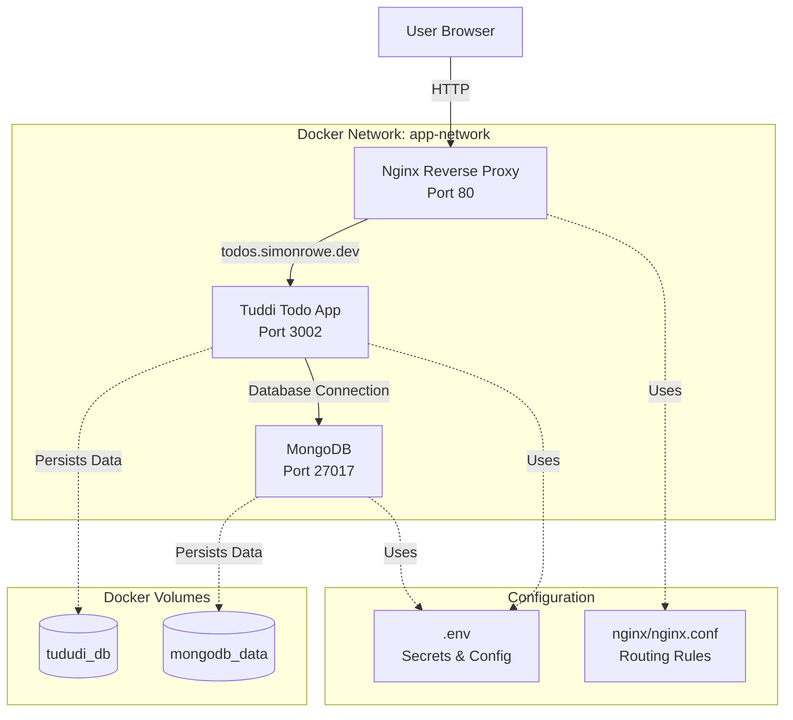

# Docker Compose Development Environment

A multi-service Docker Compose environment for development with MongoDB, Tuddi todo application, and Nginx reverse proxy.

## 🏗️ Architecture



## 🚀 Quick Start

1. **Start Colima**
   ```bash
   colima start --memory 12 --disk 100 --mount-type 9p
   ```

2. **Clone and Setup**
   ```bash
   git clone <repository-url>
   cd docker-compose-env
   ```

3. **Configure Environment**
   ```bash
   cp docker/.env.template docker/.env
   # Edit docker/.env with your actual credentials
   ```

4. **Start Services**
   ```bash
   ./scripts/start.sh
   ```
5. **Access Services**
   - Todo App: http://todos.simonrowe.dev (via nginx proxy)
   - MongoDB: localhost:27017 (direct access)

6. **Stop Services**
   ```bash
   ./scripts/stop.sh
   ```

## 📁 Project Structure

```
docker-compose-env/
├── docker/
│   ├── data-stores.yml      # MongoDB and other data stores
│   ├── tools.yml            # Third-party tools (Tuddi)
│   ├── reverse-proxy.yml    # Nginx reverse proxy
│   ├── nginx/
│   │   └── nginx.conf       # Nginx configuration
│   ├── .env.template        # Environment variables template
│   └── .env                 # Your actual secrets (not committed)
├── scripts/
│   ├── start.sh            # Start all services
│   └── stop.sh             # Stop all services
├── CLAUDE.md               # AI assistant instructions
└── README.md               # This file
```

## 🔧 Services

### MongoDB
- **Image**: `mongo:4.4`
- **Port**: `27017`
- **Authentication**: Enabled with root user
- **Volume**: `mongodb_data`

### Tuddi Todo App
- **Image**: `chrisvel/tududi:latest`
- **Port**: `3002` (internal)
- **Access**: via `todos.simonrowe.dev`
- **Volume**: `tududi_db`

### Nginx Reverse Proxy
- **Image**: `nginx:alpine`
- **Port**: `80`
- **Routes**: `todos.simonrowe.dev` → Tuddi

## ⚙️ Configuration

### Environment Variables

Required variables in `docker/.env`:

```bash
# MongoDB Configuration
MONGO_ROOT_USERNAME=root
MONGO_ROOT_PASSWORD=your_secure_password_here

# Tududi Configuration
TUDUDI_USER_EMAIL=your_email@example.com
TUDUDI_USER_PASSWORD=your_secure_password_here
TUDUDI_SESSION_SECRET=your_generated_hash_here
```

### Nginx Routing

The nginx configuration routes traffic based on the `Host` header:
- `todos.simonrowe.dev` → Tuddi container on port 3002
- All other requests → Return 444 (connection closed)

## 🌐 Networking

All services run on the `app-network` Docker network, enabling:
- Service discovery by container name
- Internal communication without exposing ports
- Isolation from other Docker networks

## 💾 Data Persistence

- **MongoDB**: Uses `mongodb_data` Docker volume
- **Tuddi**: Uses `tududi_db` Docker volume
- No host filesystem mounts for better portability

## 🛠️ Development

### Adding New Services

1. Create new `.yml` file in `docker/` directory
2. Add to `COMPOSE_FILES` array in both `scripts/start.sh` and `scripts/stop.sh`
3. Ensure service uses `app-network` for inter-service communication

### Updating Configuration

- **Environment variables**: Edit `docker/.env`
- **Nginx routing**: Edit `docker/nginx/nginx.conf`
- **Service configuration**: Modify respective `.yml` files

### Troubleshooting

```bash
# View running containers
docker ps

# View logs for specific service
docker logs <container-name>

# View network information
docker network ls
docker network inspect docker_app-network

# View volumes
docker volume ls
docker volume inspect <volume-name>
```

## 📝 Notes

- Environment files contain sensitive data and should not be committed
- All services use Docker volumes for persistent data
- The environment is designed for development use
- Make sure to update your `/etc/hosts` file or DNS to point `todos.simonrowe.dev` to localhost for local testing

---

*This environment is managed with Claude AI assistant. See `CLAUDE.md` for AI context and instructions.*