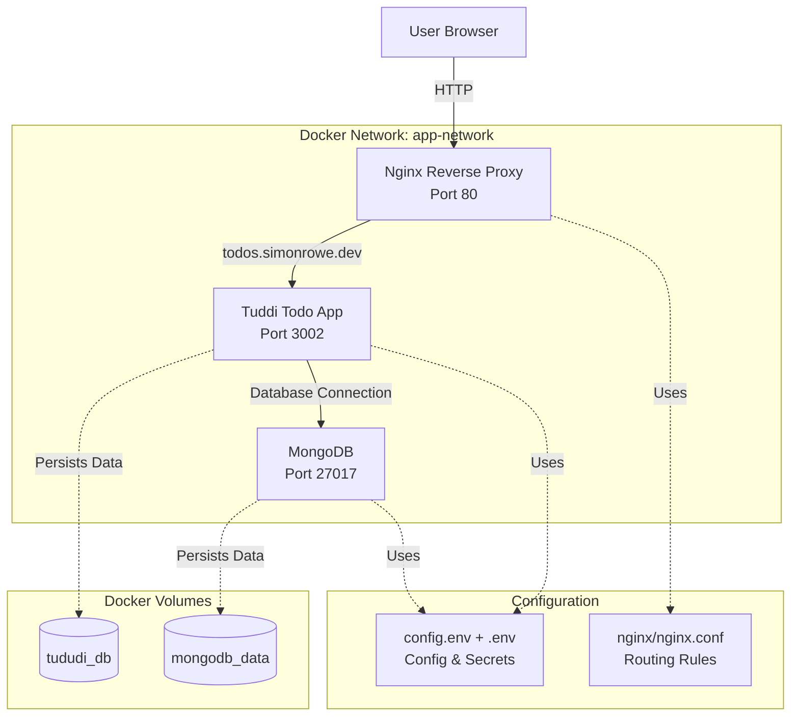

# Docker Compose Development Environment

A multi-service Docker Compose environment for development with MongoDB, Tuddi todo application, and Nginx reverse proxy.

## 🏗️ Architecture



## 🚀 Quick Start

1. **Start Colima**
   ```bash
   colima start --memory 12 --disk 100 --mount-type 9p
   ```

2. **Clone and Setup**
   ```bash
   git clone <repository-url>
   cd docker-compose-env
   ```

3. **Configure Environment**
   ```bash
   cp docker/.env.template docker/.env
   # Edit docker/.env with your secrets (passwords, tokens)
   # Edit docker/config.env (or copy docker/config.env.template if you need a fresh base)
   ```

4. **Local Domains**

   Nothing needs to be added to `/etc/hosts`. Modern browsers map any `*.localhost` host to `127.0.0.1` automatically, so the stack is reachable locally via `simonrowe.localhost`, `api.simonrowe.localhost`, etc. The real `simonrowe.dev` domain is only provided through LocalXpose + Cloudflare and should never be mocked via local DNS.

5. **Start Services**
   ```bash
   ./scripts/start.sh
   ```
6. **Access Services**

   **Cloud Links (LocalXpose + Cloudflare)**
   - Main Website: https://simonrowe.dev
   - Backend API: https://api.simonrowe.dev
   - Strapi CMS: https://cms.simonrowe.dev
   - Tuddi Todo App: https://todos.simonrowe.dev
   - Conduktor Kafka UI: https://conduktor.simonrowe.dev

   **Via Nginx Reverse Proxy (Port 8080)**
   - Main Website: http://simonrowe.localhost:8080
   - Backend API: http://api.simonrowe.localhost:8080
   - Strapi CMS: http://cms.simonrowe.localhost:8080
   - Tuddi Todo App: http://todos.simonrowe.localhost:8080
   - Conduktor Kafka UI: http://conduktor.simonrowe.localhost:8080

   **Direct Access (Bypassing Nginx)**
   - React UI: http://localhost:3000
   - Backend API: http://localhost:8081
   - Strapi CMS: http://localhost:1337
   - Tuddi: http://localhost:3002
   - Conduktor: http://localhost:8088
   - Kibana: http://localhost:5601
   - MongoDB: localhost:27017
   - Kafka: localhost:29092
   - Elasticsearch: http://localhost:9200
   - PostgreSQL: localhost:5432

   The cloud links depend on the LocalXpose tunnel and Cloudflare DNS configuration described below—without the tunnel they will not resolve.

7. **Stop Services**
   ```bash
   ./scripts/stop.sh
   ```

## 🔗 Service Endpoints

| Service | Cloud URL (LocalXpose + Cloudflare) | Local Reverse Proxy (Nginx 8080) | Direct Access |
| --- | --- | --- | --- |
| Main Website (React UI) | https://simonrowe.dev | http://simonrowe.localhost:8080 | http://localhost:3000 |
| Backend API | https://api.simonrowe.dev | http://api.simonrowe.localhost:8080 | http://localhost:8081 |
| Strapi CMS | https://cms.simonrowe.dev | http://cms.simonrowe.localhost:8080 | http://localhost:1337 |
| Tuddi Todo App | https://todos.simonrowe.dev | http://todos.simonrowe.localhost:8080 | http://localhost:3002 |
| Conduktor Kafka UI | https://conduktor.simonrowe.dev | http://conduktor.simonrowe.localhost:8080 | http://localhost:8088 |
| Kibana | — | — | http://localhost:5601 |

Cloud URLs require the LocalXpose tunnel plus the Cloudflare DNS described later; local URLs and direct access continue working without the tunnel.

## 🌐 LocalXpose Hosting

1. **Reserve the domain with LocalXpose**
   ```bash
   loclx domain reserve --domain simonrowe.dev --region eu
   loclx domain status --domain simonrowe.dev    # wait for “verified”
   ```
   Copy the `*.cname.loclx.io` target returned by the reserve command for DNS.

2. **Configure the tunnel**
   ```bash
   cp docker/.env.template docker/.env          # if not already done
   cp docker/config.env.template docker/config.env  # optional reset for config values
   # Edit docker/config.env
   LOCALXPOSE_ENABLED=true
   LOCALXPOSE_DOMAIN=simonrowe.dev      # or a wildcard/domain you reserved
   LOCALXPOSE_TUNNEL_PORT=8080          # nginx reverse proxy inside Docker
   LOCALXPOSE_REGION=eu                 # optional override (defaults to eu)
   # Edit docker/.env
   LOCALXPOSE_AUTH_TOKEN=<your access token from https://localxpose.io/dashboard/access>
   ```
   `./scripts/start.sh` logs in with `loclx account login`, ensures `localxpose.tunnels.yaml` exists (creating it from the defaults above if missing), then calls `scripts/localxpose-start.sh` (a zsh helper) which runs `loclx tunnel config -f localxpose.tunnels.yaml --raw-mode …` in the background. Edit `localxpose.tunnels.yaml` to add more tunnels or tweak the reserved domain/port as needed. The PID is stored in `.localxpose.pid` and logs are written to `logs/localxpose.log`. Use `./scripts/stop.sh` or `scripts/localxpose-stop.sh` to tear the tunnel down.

3. **Cloudflare DNS**
   - Create a proxied **CNAME** for the apex (`@`) pointing to the value returned earlier (e.g. `8kplouxq3znu.cname.loclx.io`). Cloudflare’s CNAME flattening serves it to clients as the correct `A/AAAA` records, so no manual `A` record is required.
   - Add a second proxied **CNAME** for `*.simonrowe.dev` to the same target if you want subdomains (api, cms, todos, etc.) to resolve through the tunnel.
   - If you must create an explicit `A` record, point it to the IP that `dig <your-value>.cname.loclx.io` currently resolves to, but be aware that LocalXpose can rotate these IPs—CNAME flattening is safer.
   - Keep the records in “Proxied” mode so Cloudflare handles TLS and keeps the LocalXpose address hidden.

Once DNS propagates you can hit `https://simonrowe.dev` (and the subdomains) through the LocalXpose tunnel without modifying `/etc/hosts`.

## 📁 Project Structure

```
docker-compose-env/
├── docker/
│   ├── data-stores.yml      # MongoDB, PostgreSQL, Kafka, Elasticsearch
│   ├── tools.yml            # Third-party tools (Tuddi, Conduktor)
│   ├── services.yml         # Custom services (Strapi, React UI, Backend)
│   ├── reverse-proxy.yml    # Nginx reverse proxy
│   ├── nginx/
│   │   └── nginx.conf       # Nginx configuration
│   ├── config.env           # Shared non-secret config (committed)
│   ├── config.env.template  # Template for config overrides
│   ├── .env.template        # Secrets template
│   └── .env                 # Local secrets (gitignored)
├── scripts/
│   ├── start.sh             # Start all services
│   ├── stop.sh              # Stop all services
│   └── restore-backup.sh    # Restore MongoDB and Strapi uploads from backup
├── localxpose.tunnels.yaml  # LocalXpose tunnel config (edit to customize)
├── CLAUDE.md                # AI assistant instructions
└── README.md                # This file
```

## 🔧 Services

### Data Stores

**MongoDB**
- **Image**: `mongo:4.4`
- **Port**: `27017`
- **Authentication**: Enabled with root user
- **Volume**: `mongodb_data`
- **Used by**: Strapi CMS

**PostgreSQL**
- **Image**: `postgres:15-alpine`
- **Port**: `5432`
- **Volume**: `postgres_data`
- **Used by**: Conduktor

**Kafka + Zookeeper**
- **Kafka Image**: `confluentinc/cp-kafka:7.5.0`
- **Zookeeper Image**: `confluentinc/cp-zookeeper:7.5.0`
- **Kafka Ports**: `9092` (internal), `29092` (host)
- **Zookeeper Port**: `2181`
- **Volumes**: `kafka_data`, `zookeeper_data`, `zookeeper_log`
- **Used by**: Backend, Conduktor

**Elasticsearch**
- **Image**: `docker.elastic.co/elasticsearch/elasticsearch:8.11.0`
- **Ports**: `9200` (HTTP), `9300` (transport)
- **Volume**: `elasticsearch_data`
- **Used by**: Backend

**Kibana**
- **Image**: `docker.elastic.co/kibana/kibana:8.11.0`
- **Port**: `5601`
- **Access**: http://localhost:5601 (not exposed via nginx)
- **Purpose**: UI for exploring Elasticsearch indices/logs

### Core Services

**Strapi CMS**
- **Image**: `ghcr.io/simonjamesrowe/strapi-cms:v0.1.3`
- **Port**: `1337`
- **Access**: http://cms.simonrowe.dev:8080
- **Volume**: `strapi_uploads`
- **Purpose**: Headless CMS for content management

**React UI**
- **Image**: `ghcr.io/simonjamesrowe/react-ui:v0.3.0`
- **Port**: `3000` (host) → `80` (container)
- **Access**: http://simonrowe.dev:8080
- **Purpose**: Personal portfolio/resume SPA

**Backend Modulith**
- **Image**: `ghcr.io/simonjamesrowe/backend:latest`
- **Port**: `8081` (host) → `8080` (container)
- **Access**: http://api.simonrowe.dev:8080
- **Purpose**: Unified REST API, search indexing, and webhook handling

### Tools

**Tuddi Todo App**
- **Image**: `chrisvel/tududi:latest`
- **Port**: `3002`
- **Access**: http://todos.simonrowe.dev:8080
- **Volume**: `tududi_db`

**Conduktor**
- **Image**: `conduktor/conduktor-platform:latest`
- **Port**: `8088` (host) → `8080` (container)
- **Access**: http://conduktor.simonrowe.dev:8080
- **Purpose**: Kafka management UI

### Nginx Reverse Proxy
- **Image**: `nginx:alpine`
- **Port**: `8080` (host) → `80` (container)
- **Routes**:
  - `simonrowe.dev` / `www.simonrowe.dev` → React UI
  - `api.simonrowe.dev` → Backend
  - `cms.simonrowe.dev` → Strapi CMS
  - `todos.simonrowe.dev` → Tuddi
  - `conduktor.simonrowe.dev` → Conduktor

## ⚙️ Configuration

### Environment Variables

`docker/config.env` (committed) holds non-secret configuration such as versions, URLs, and feature toggles:

```bash
# Version pins
STRAPI_VERSION=latest
REACT_UI_VERSION=latest
BACKEND_VERSION=latest

# Database / service configuration
POSTGRES_DB=conduktor
STRAPI_DATABASE_NAME=strapi

# Service endpoints
API_URL=http://backend:8080
CMS_URL=http://strapi-cms:1337
SPRING_KAFKA_BOOTSTRAP_SERVERS=kafka:9092

# Elasticsearch defaults
ELASTICSEARCH_HOST=elasticsearch
ELASTICSEARCH_PORT=9200
ELASTICSEARCH_SSL_ENABLED=false

# Frontend / observability
GA_TRACKING_TOKEN=
KIBANA_PUBLIC_URL=http://kibana.simonrowe.localhost:8080
SPRING_PROFILES_ACTIVE=prod

# LocalXpose settings (token lives in .env)
LOCALXPOSE_ENABLED=false
LOCALXPOSE_DOMAIN=simonrowe.dev
LOCALXPOSE_TUNNEL_PORT=8080
LOCALXPOSE_REGION=eu
LOCALXPOSE_EXTRA_ARGS=
```

`docker/.env` (gitignored) stores secrets and private credentials:

```bash
# MongoDB credentials
MONGO_ROOT_USERNAME=root
MONGO_ROOT_PASSWORD=your_secure_password_here

# PostgreSQL credentials
POSTGRES_USER=postgres
POSTGRES_PASSWORD=your_secure_password_here

# Tududi credentials
TUDUDI_USER_EMAIL=your_email@example.com
TUDUDI_USER_PASSWORD=your_secure_password_here
TUDUDI_SESSION_SECRET=your_generated_hash_here

# Conduktor admin credentials
CONDUKTOR_ADMIN_EMAIL=admin@example.com
CONDUKTOR_ADMIN_PASSWORD=admin

# Strapi secrets
STRAPI_ADMIN_JWT_SECRET=your_jwt_secret_here

# Backend secrets
SENDGRID_API_KEY=your_sendgrid_api_key_here
SENDGRID_FROM_EMAIL=noreply@example.com
SENDGRID_TO_EMAIL=your_email@example.com
ELASTICSEARCH_USERNAME=
ELASTICSEARCH_PASSWORD=

# LocalXpose credentials
LOCALXPOSE_AUTH_TOKEN=
```

### Nginx Routing

The nginx configuration routes traffic based on the `Host` header:
- `simonrowe.dev` / `www.simonrowe.dev` / `simonrowe.localhost` / `www.simonrowe.localhost` → React UI (port 80)
- `api.simonrowe.dev` / `api.simonrowe.localhost` → Backend (port 8080)
- `cms.simonrowe.dev` / `cms.simonrowe.localhost` → Strapi CMS (port 1337)
- `todos.simonrowe.dev` / `todos.simonrowe.localhost` → Tuddi (port 3002)
- `conduktor.simonrowe.dev` / `conduktor.simonrowe.localhost` → Conduktor (port 8080)
- All other requests → Return 444 (connection closed)

### DNS/Hosts Configuration

For local development, you can use either `.dev` or `.localhost` domains:

**Option 1: Using `.dev` domains** (requires `/etc/hosts` entries):
```
127.0.0.1 simonrowe.dev www.simonrowe.dev
127.0.0.1 api.simonrowe.dev
127.0.0.1 cms.simonrowe.dev
127.0.0.1 todos.simonrowe.dev
127.0.0.1 conduktor.simonrowe.dev
```

**Option 2: Using `.localhost` domains** (automatic, no hosts file needed):
- `simonrowe.localhost:8080`
- `api.simonrowe.localhost:8080`
- `cms.simonrowe.localhost:8080`
- `todos.simonrowe.localhost:8080`
- `conduktor.simonrowe.localhost:8080`

Modern browsers automatically resolve `.localhost` domains to `127.0.0.1`, so no `/etc/hosts` configuration is needed for `.localhost` domains.

**On macOS/Linux:**
```bash
sudo nano /etc/hosts
```

**On Windows:**
```powershell
notepad C:\Windows\System32\drivers\etc\hosts
```

## 🌐 Networking

All services run on the `app-network` Docker network, enabling:
- Service discovery by container name
- Internal communication without exposing ports
- Isolation from other Docker networks

## 💾 Data Persistence

All services use named Docker volumes for persistent data:

- **mongodb_data**: MongoDB database files
- **postgres_data**: PostgreSQL database files
- **kafka_data**: Kafka message logs
- **zookeeper_data**: Zookeeper data
- **zookeeper_log**: Zookeeper transaction logs
- **elasticsearch_data**: Elasticsearch indices
- **strapi_uploads**: Strapi CMS uploaded media files
- **tududi_db**: Tuddi todo app database
- **conduktor_data**: Conduktor configuration and state

No host filesystem mounts are used for better portability across different environments.

## 🛠️ Development

### Adding New Services

1. Create new `.yml` file in `docker/` directory
2. Add to `COMPOSE_FILES` array in both `scripts/start.sh` and `scripts/stop.sh`
3. Ensure service uses `app-network` for inter-service communication

### Updating Configuration

- **Environment variables**: Edit `docker/config.env` for shared config and `docker/.env` for secrets
- **Nginx routing**: Edit `docker/nginx/nginx.conf`
- **Service configuration**: Modify respective `.yml` files

### Troubleshooting

```bash
# View running containers
docker ps

# View logs for specific service
docker logs <container-name>

# View network information
docker network ls
docker network inspect docker_app-network

# View volumes
docker volume ls
docker volume inspect <volume-name>
```

## 🔄 Data Backup & Restore

To restore MongoDB and Strapi uploads from a backup:

```bash
# Ensure backup exists at ~/Downloads/sjr-backup-31Oct2021/
./scripts/start.sh
./scripts/restore-backup.sh
docker restart strapi-cms
```

## 📝 Notes

- Environment files contain sensitive data and should not be committed to version control
- All services use Docker volumes for persistent data (no host filesystem mounts)
- The environment is designed for local development use
- **Important**: You must add DNS entries to `/etc/hosts` for domain-based routing to work locally
- Custom services (Strapi, React UI, Backend) are available at https://github.com/simonjamesrowe
- ARM64 support: React UI has multi-arch images; Java services use `platform: linux/amd64` for x86 emulation

---
